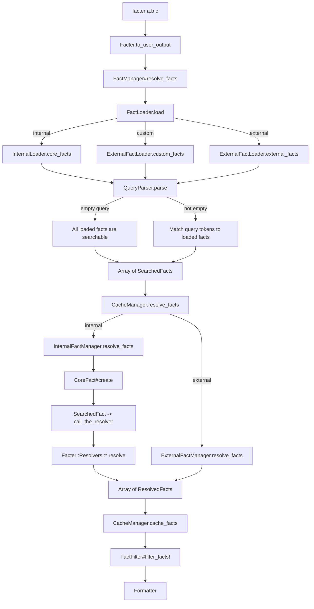

## Data Flow

This shows the general data flow when a user runs facter on the command to lookup facts `a.b` and `c`.

Generally, facter loads fact definitions (`LoadedFact`) to determine all of the things it could collect, including internal (aka core) facts, custom facts (implemented using the `Facter.add` API) and external facts (json, yaml, bash, etc). Each `LoadedFact` specifies a name like `os.family` and a class that can be called later to collect the values, e.g. `Facts::Linux::Os::Release`.

The `QueryParser` parse both user queries `a.b` and `c` and matches each query against all LoadedFacts, returning an array of `SearchedFacts`. These are more like SearchableFacts, since they haven't been searched yet.

Facter attempts to lookup the facts from the cache, otherwise it calls the `InternalFactManager` and `ExternalFactManager` to resolve facts.

For internal facts, facter wraps each `SearchedFact` with a `CoreFact`. The `CoreFact` calls the `call_the_resolver` method on the class that the `SearchedFact` references. The `call_the_resolver` method then typically delegates to a resolver and returns the fact value which may be scalar or structured data. For example, `os.family` returns a string, but `gce` returns a Hash.

